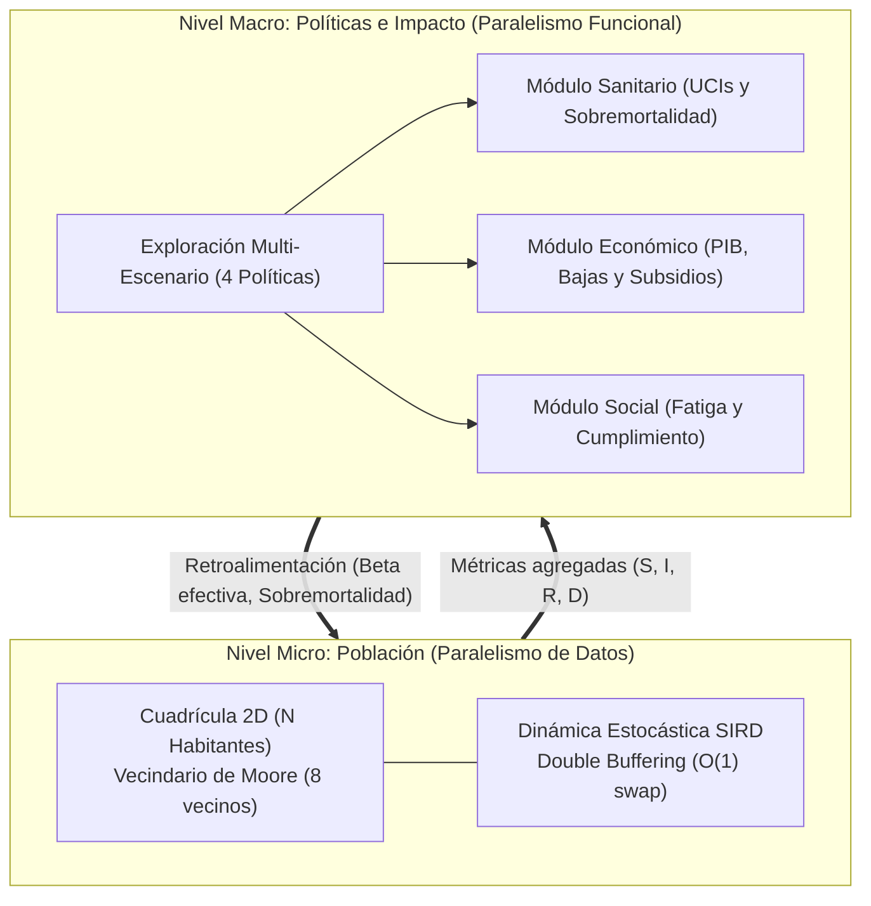
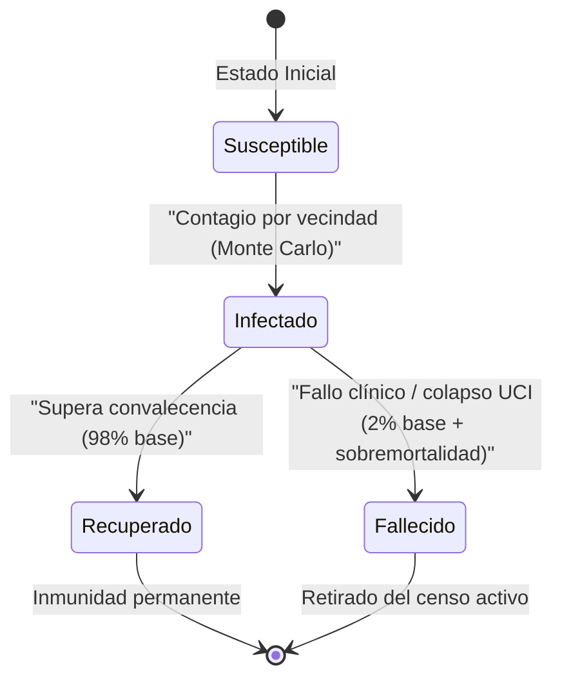
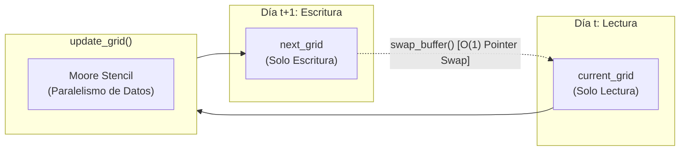

# Modelo Matemático y Algorítmico de PandemicSim

Este documento describe en profundidad el modelo epidemiológico, socioeconómico y computacional implementado en **PandemicSim** para la **Práctica 2** de *Ingeniería de los Computadores*.

---

## 1. Visión General del Sistema

**PandemicSim** combina dos niveles de modelado:
1. **Nivel Micro (Dinámica Epidemiológica):** Un autómata celular estocástico bidimensional con vecindario de Moore que simula la interacción física y el contagio entre individuos.
2. **Nivel Macro (Evaluación de Impacto y Políticas):** Módulos desacoplados que analizan el impacto sanitario, económico y social de diversas medidas gubernamentales.



---

## 2. Dinámica Epidemiológica: Conceptos y Autómata Celular

El modelo de simulación discretiza la población en una cuadrícula bidimensional regular de tamaño $H \times W = N$. Cada celda representa a un habitante individual.

### 2.1. ¿Qué es el Modelo SIRD y qué significa cada estado?

En epidemiología matemática, el modelo **SIRD** es un modelo clásico de compartimentos (evolución del modelo SIR propuesto por Kermack y McKendrick en 1927). Agrupa a la población en 4 categorías disjuntas según su estado biológico frente al patógeno:

| Compartimento | Sigla | Estado en C | Significado en la Simulación |
| :--- | :---: | :---: | :--- |
| **Susceptible** | **S** | `0` (`SUSCEPTIBLE`) | Individuo sano que no ha estado en contacto con el virus y carece de anticuerpos. Puede contagiarse si tiene vecinos infectados. |
| **Infectado** | **I** | `1` (`INFECTED`) | Individuo enfermo y contagioso. Transmite el virus a sus vecinos sanos y genera gasto asistencial (bajas médicas, camas de hospital y UCI). Mantiene un contador de días enfermo. |
| **Recuperado** | **R** | `2` (`RECOVERED`) | Individuo que ha superado el periodo de convalecencia clínica (10 días) y ha sobrevivido. Adquiere **inmunidad permanente**: ya no puede infectarse ni transmitir el virus. |
| **Fallecido** | **D** (*Dead*) | `3` (`DEAD`) | Individuo que no superó la infección debido a la gravedad clínica o al colapso de las UCIs. Queda inerte en la malla (no interactúa más). |

> [!NOTE] ¿Por qué SIRD y no un modelo SIR estándar?
> El modelo básico SIR agrupa en una única categoría a todos los que "salen" de la enfermedad (tanto recuperados como fallecidos). En nuestra práctica, el modelo **SIRD** separa explícitamente a los fallecidos (**D**) para cuantificar el coste en vidas humanas y modelar la **sobremortalidad provocada por el colapso hospitalario de las camas UCI**, permitiendo comparar el impacto humano frente al coste económico de cada política.

---

### 2.2. ¿Qué es la Tasa Beta ($\beta$) y la Beta Efectiva?

En los modelos epidemiológicos, **$\beta$ (Beta)** representa la **tasa de transmisión básica por contacto** (la probabilidad de que el virus se transmita de un infectado a un susceptible en una interacción):

$$\beta \in [0.0, 1.0]$$

* **Interpretación física intuitiva:** Si una persona sana pasa un día junto a un vecino infectado, $\beta$ es la probabilidad de que ese vecino le contagie el virus.
  * Por ejemplo, si $\beta = 0.35$, existe un **35% de probabilidad** de infectarse en un día por cada vecino contagiado.
* **¿Por qué varía el valor de $\beta$ según la política gubernamental?**
  El virus biológicamente es idéntico, pero las medidas políticas alteran drásticamente la cercanía y la frecuencia del contacto entre ciudadanos:
  * **Sin restricciones (`LaissezFaire`, $\beta = 0.35$):** Vida normal sin mascarillas ni distancia; máxima transmisión.
  * **Teletrabajo y mascarillas (`RemoteWork`, $\beta = 0.15$):** Se reduce el contacto en transporte público y oficinas, bajando el contagio a menos de la mitad.
  * **Confinamiento estricto (`Lockdown`, $\beta = 0.05$):** Interacción física reducida al mínimo indispensable (solo servicios esenciales).
* **¿Qué es la Beta Efectiva ($\beta_{\text{efectivo}}$)?**
  En el mundo real, las normas impuestas por decreto sufren desgaste con el tiempo. El simulador modela la **fatiga social** (el hartazgo de la población por las restricciones prolongadas), lo que provoca una caída en el factor de cumplimiento ciudadano ($C_t \le 1.0$).
  La tasa real de contagio diaria se calcula modulando $\beta$ por el cumplimiento:
  $$\beta_{\text{efectivo}} = \frac{\beta_{\text{política}}}{C_t}$$
  * Si el cumplimiento es del 100% ($C_t = 1.0$), $\beta_{\text{efectivo}} = \beta$.
  * Si la población se relaja y el cumplimiento cae al 50% ($C_t = 0.50$), la tasa de transmisión efectiva se **duplica** ($\beta / 0.50 = 2\beta$), reflejando que de nada sirve tener normas estrictas si la ciudadanía no las acata.

---

### 2.3. Diagrama de Transición de Estados



---

### 2.4. Topología Espacial: Vecindario de Moore

Cada celda $(i, j)$ interactúa directamente con sus **8 vecinos contiguos** (distancia de Chebyshev $D_\infty = 1$):

```text
       ┌──────────────┬──────────────┬──────────────┐
       │  (i-1, j-1)  │   (i-1, j)   │  (i-1, j+1)  │
       ├──────────────┼──────────────┼──────────────┤
       │   (i, j-1)   │  CELDA (i,j) │   (i, j+1)   │
       ├──────────────┼──────────────┼──────────────┤
       │  (i+1, j-1)  │   (i+1, j)   │  (i+1, j+1)  │
       └──────────────┴──────────────┴──────────────┘
```

En los límites de la malla ($i=0, i=H-1, j=0, j=W-1$) se aplican condiciones de contorno no periódicas (bordes cerrados), evaluando únicamente los vecinos físicamente existentes dentro del mapa.

---

### 2.5. Formulación Estocástica del Contagio

Para una celda susceptible $(i, j)$, se cuenta el número de vecinos inmediatos infectados:
$$k = \sum_{\delta_i = -1}^{1} \sum_{\delta_j = -1}^{1} \mathbb{I}(\text{celda}[i+\delta_i, j+\delta_j] == \text{INFECTED}) \quad \text{con } (\delta_i, \delta_j) \neq (0,0)$$

Siendo $\beta_{\text{efectivo}}$ la probabilidad diaria de transmisión por contacto con un individuo infectado:

1. **Probabilidad de no contagio de un vecino:** $(1 - \beta_{\text{efectivo}})$
2. **Probabilidad de no contraer el virus de ninguno de los $k$ vecinos infectados:**
   $$P(\text{no contagio}) = (1 - \beta_{\text{efectivo}})^k$$
3. **Probabilidad de contagio (suceso complementario):**
   $$P(\text{contagio}) = 1 - (1 - \beta_{\text{efectivo}})^k$$

#### Resolución por Método Monte Carlo
En cada paso temporal, la CPU genera un número pseudoaleatorio uniforme $r \sim \mathcal{U}[0, 1)$:
$$\text{NuevoEstado}(i, j) = \begin{cases} \text{INFECTED}, & \text{si } r < P(\text{contagio}) \\ \text{SUSCEPTIBLE}, & \text{en caso contrario} \end{cases}$$

---

### 2.6. Proceso de Convalecencia y Sobremortalidad

Cuando una celda está en estado **INFECTED**:
* Se incrementa su contador de días: $\text{days\_infected}[i, j] \leftarrow \text{days\_infected}[i, j] + 1$.
* Cuando alcanza el periodo crítico ($\text{days\_infected} \ge 10$ días):
  $$P(\text{muerte}) = P_{\text{muerte\_base}} \times f_{\text{sobremortalidad}}$$
  *(Donde $P_{\text{muerte\_base}} = 0.02$ y $f_{\text{sobremortalidad}} \ge 1.0$ proviene del módulo sanitario).*
* Mediante un nuevo muestreo Monte Carlo con $r \sim \mathcal{U}[0, 1)$:
  $$\text{NuevoEstado}(i, j) = \begin{cases} \text{DEAD}, & \text{si } r < P(\text{muerte}) \\ \text{RECOVERED}, & \text{si } r \ge P(\text{muerte}) \end{cases}$$

---

## 3. Técnica del Doble Búfer y Organización en Memoria

Para garantizar un cálculo determinista y evitar condiciones de carrera intra-paso, se utiliza la técnica de **Double Buffering**.



### Justificación de Memoria y Localidad de Caché
* **Estructura contigua plana (*Row-Major*):** Las matrices bidimensionales se asignan en memoria dinámica como un bloque contiguo lineal:
  $$\text{idx} = i \times \text{width} + j$$
* **Localidad espacial (*Stride = 1*):** El recorrido por filas consecutivas (`for (int i...) for (int j...)`) garantiza que cada línea de caché L1/L2 cargada desde memoria principal (64 bytes) sirva para procesar hasta 16 celdas contiguas de tipo `int` sin fallos adicionales de caché (*cache misses*).
* **Autovectorización SIMD:** El acceso regular y libre de solapamiento permite que compiladores como GCC autovectoricen operaciones con instrucciones AVX2 de 256 bits.
* **Costo nulo de actualización:** El avance de día se ejecuta en tiempo $\mathcal{O}(1)$ mediante un intercambio de punteros (`temp = current_grid; current_grid = next_grid; next_grid = temp;`), evitando duplicar matrices en RAM.

---

## 4. Módulos Analíticos de Impacto Socioeconómico

Al inicio de cada día se obtiene el censo global $(S_t, I_t, R_t, D_t)$ y se evalúan tres módulos desacoplados:

### 4.1. Módulo Sanitario (`healthcare.c`)
Modela la saturación de los recursos hospitalarios y el incremento de letalidad asociado:
* **Demanda asistencial:**
  $$\text{Camas}_{\text{planta}} = \lceil I_t \times 0.15 \rceil, \quad \text{Demanda}_{\text{UCI}} = \lceil I_t \times 0.05 \rceil$$
* **Capacidad instalada:** $\text{Capacidad}_{\text{UCI}} = \max(1, \lfloor N \times 0.005 \rfloor)$ *(0.5% de la población total)*.
* **Evaluación de colapso:**
  $$\text{Sobrecarga} = \max(0, \text{Demanda}_{\text{UCI}} - \text{Capacidad}_{\text{UCI}})$$
  Si $\text{Sobrecarga} > 0$, se registra un día de colapso hospitalario y se calcula el factor de sobremortalidad clínica:
  $$f_{\text{sobremortalidad}} = 1.0 + \frac{\text{Sobrecarga}}{\text{Capacidad}_{\text{UCI}}}$$
* **Coste sanitario acumulado:**
  $$\Delta \text{Coste}_{\text{salud}} = (\text{Demanda}_{\text{UCI}} \times 1.200\text{ €}) + (\text{Camas}_{\text{planta}} \times 400\text{ €})$$

---

### 4.2. Módulo Económico (`economy.c`)
Calcula el balance económico derivado de la epidemia y de las medidas de contención:
1. **Pérdida por bajas laborales:**
   $$\text{Coste}_{\text{bajas}} = I_t \times 120\text{ €/día}$$
2. **Pérdida por restricción de actividad económica:**
   Asumiendo una base de PIB nominal diario de $100\text{ €}$ por habitante:
   $$\text{Coste}_{\text{restricción}} = (N \times 100\text{ €}) \times \text{trade\_restriction}$$
3. **Gasto fiscal en subsidios públicos:** $\text{daily\_subsidy\_expense}$ (según la política activa).
4. **Coste económico total del día:**
   $$\Delta \text{Coste}_{\text{eco}} = \text{Coste}_{\text{bajas}} + \text{Coste}_{\text{restricción}} + \text{daily\_subsidy\_expense}$$

---

### 4.3. Módulo Social y Cumplimiento (`society.c`)
Modela la conducta y adherencia ciudadana frente a medidas restrictivas:
* **Fatiga social acumulada ($F_t$):**
  $$F_{t+1} = F_t + (\text{trade\_restriction} \times 0.01)$$
* **Factor de cumplimiento ciudadano ($C_t$):**
  $$C_t = \max(0.40, 1.0 - F_t)$$
  *(Se fija un suelo del 40% de cumplimiento mínimo).*
* **Retroalimentación epidemiológica:** La tasa de transmisión efectiva del virus aumenta a medida que cae el cumplimiento:
  $$\beta_{\text{efectivo}} = \frac{\beta_{\text{política}}}{C_t}$$

---

## 5. Escenarios Simulados en `config/policies.conf`

| Escenario | $\beta$ base | Restricción Comercial | Subsidios / Día | Umbral UCI Dinámico | Descripción |
| :--- | :---: | :---: | :---: | :---: | :--- |
| **`LaissezFaire`** | 0.35 | 0% | 0 € | Desactivado | Sin restricciones; máxima propagación y colapso de UCI, bajo coste por cierres. |
| **`Lockdown`** | 0.05 | 60% | 1.500.000 € | Desactivado | Confinamiento severo continuo; aplana la curva pero genera alto gasto fiscal y fatiga social extrema. |
| **`RemoteWork`** | 0.15 | 15% | 300.000 € | Desactivado | Medidas moderadas (mascarillas y teletrabajo selectivo); equilibrio socioeconómico. |
| **`DynamicSignals`** | 0.35 / 0.08 | 0% / 50% | 1.000.000 € | 80% UCI | Semáforo reactivo: activa confinamiento perimetral solo cuando la saturación de UCIs supera el 80%. |

---
